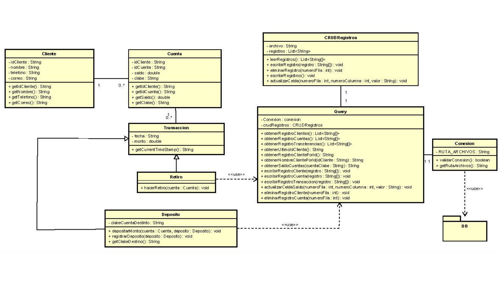

# EVAL-2

# Client:
Your system is weird, i like it!
 
"Modelo" and "Controllers" need to be created in order to implement the MVC architecture properly. Let's start by creating them.
 
Additionally, we may also want to create a "Connection" and "Query" class, which would make it easier for the architecture to swap the CVS package with a DB."

## Requirements:
 |Non-Functional|Functional|
 |--------------|----------|
 |NF01: Make and organize Modelo and Controllers packages |F01: Make a Query class |
 |NF02: Make an MVC architecture using the csv as DB |F02: Make a Connection class|
 
 ## Limitations:
 - Cannot use a DB [Still cannot use it :(]
 - Cannot use frameworks [java vanilla]
 
 ## Notes:
- Remember model and controller definitions, if you dont know ask your nearby IT professor.
- Your code at this point may be a bit messy, which is understandable. You may need to clean it up to make it more organized and readable
- By the way, it will be a pain, but if you are asked to make queries with the CSV files... I hope you have someone to pray to

## Class Diagram:

[Im bad at this, dont worry, you´ll probably make it better]
