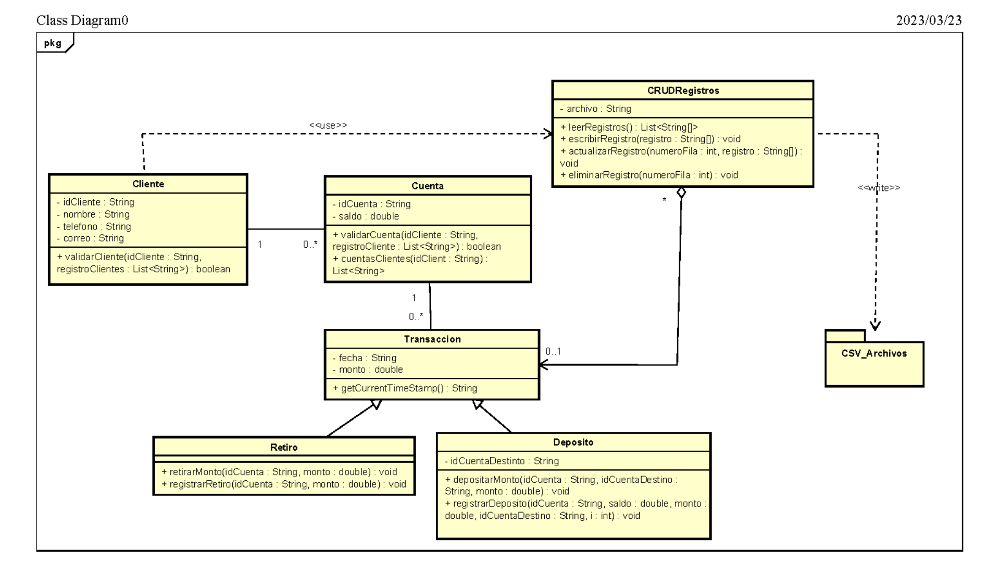

# EVAL-2

# Client:
Your system is weird, i like it! [True history]
 
"Models" and "Controllers" need to be created in order to implement the MVC architecture properly. Let's start by creating them.
 
Additionally, we may also want to create a "Connection" and "Query" class, which would make it easier for the architecture to swap the CVS package with a DB."

## Requirements:
 |Non-Functional|Functional|
 |--------------|----------|
 |NF01: Use CVS files to get information from text|F01: Only 2 transaccions [deposit and withdrawal]|
 |NF02: The system should be able to easily migrate from cvs files to DB |F02: A CRUD Query class|
 
 ## Limitations:
 - Cannot use a DB
 - Cannot use frameworks [java vanilla]
 
 ## Notes:
- Not MVC needed yet, only models
- *CLASS DIAGRAM ALWAYS FIRST!*

## Class Diagram:

[Shame on you, this is ugly]
