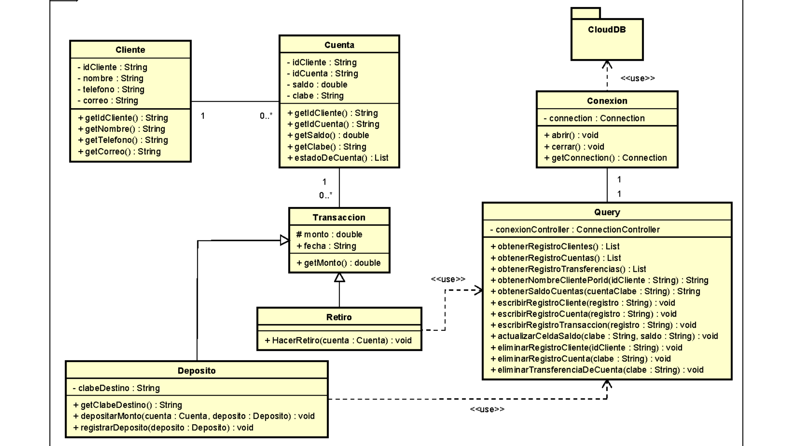

# EVALS

# User guide:
## Testing
To activate testing in any environment that supports Maven, you should enter the command 
```cmd
mvn test
```
With this code, the JUNIT dependencies will be downloaded and testing can be used
# Documentation:
## Client
Make a bank system. The system must have only one type of account, there will be only 2 transactions, and you must use information in text files.
## Limitations
 - Cannot use frameworks [java vanilla]
## Notes
- CLASS DIAGRAM ALWAYS FIRST!
## Class Diagram

